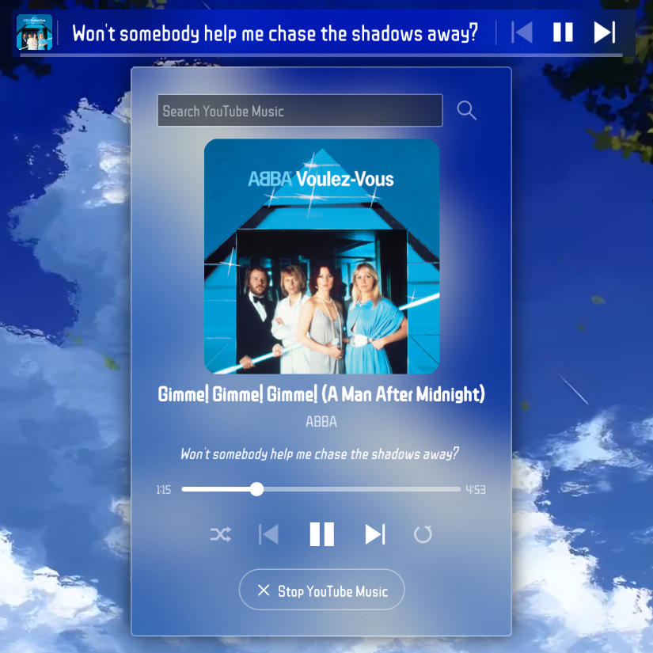

<div align="center">

# Chorus

### Chorus is a KDE Plasma 6 music bar with synced lyrics for any media player, in-widget song search and playback through YouTube Music or Spotify, and media controls.
     


</div>

> [!IMPORTANT]  
> This widget does require some setup for music search. See [SETUP.md](SETUP.md).

## Showcase

**Search and play**: search YouTube Music or Spotify from the widget and play a song directly.


https://github.com/user-attachments/assets/faf50530-13bc-4692-bbcb-5fe21c2a55e9


**Synced lyrics in your panel**: the current line updates as the song plays.


https://github.com/user-attachments/assets/e3b32a9c-cc4a-4757-b992-5d050d43fa32


**Customisable**: colors, font and size are configurable, and it works in any language.


https://github.com/user-attachments/assets/aff481a7-01e9-43f6-9053-7931b17a784e


**The popup**: album cover, song info, curren lyric, and controls for the song.


**Songs with no lyrics**: the widget shows title and artist instead.


## Features

- **Synced lyrics** from [LRCLIB](https://lrclib.net), a free and open-source lyrics library.
- Works with **any media player**: Spotify, YouTube Music, VLC, etc.
- Album cover, current lyric, playback controls, seek bar, shuffle/repeat, volume slider.
- Custom font, colors, width, font scale and other **customisation** features.
- **In-widget music search** via YouTube Music or Spotify. See [SETUP.md](SETUP.md).
- Horizontal **and** vertical panels; content rotates to read along the panel.

## Manual Install

Download from the [KDE Store](https://store.kde.org/p/2370699) or [GitHub releases](https://github.com/Netherizzium/chorus/releases).

To install:

```sh
kpackagetool6 -t Plasma/Applet -i chorus.plasmoid
```

To update:

```sh
kpackagetool6 -t Plasma/Applet -u chorus.plasmoid
```

> [!NOTE]  
> Run the commands in the same directory as the downloaded file.

## Lyrics

Lyrics come from [LRCLIB](https://lrclib.net), a free and open-source lyrics library.

> [!NOTE]  
> If lines feel early or late (e.g. Bluetooth or other latency), adjust **Lyrics timing offset** at the bottom of `Look & Feel`. Positive values show lines earlier; +500 works great for me. Sync quality can also vary from song to song; the timings are community-made, so an occasional desynced song is due to the source data, not your setup. Some songs simply have no synced lyrics on LRCLIB; the widget falls back to title/artist.

## Donations

For now, while I set up GitHub Sponsors, I only accept crypto donations:

Bitcoin
```
bc1qyv8d8mghjf9sl34we42u670fp9wska009fa5gj
```

EVM (Ethereum, BNB Smart Chain, etc)
```
0xe6E486b5d5DE64C439d868Cd16492b379bF0FAcb
```

Solana 
```
AFSiUhxK2RLBek6c6tppxHKC9qbsWLtYyW878wHGEGZP
```

## Privacy

Chorus does not collect, store, or sell any user data.
