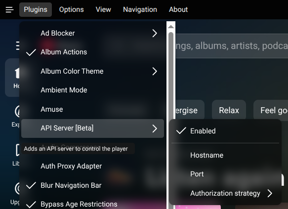
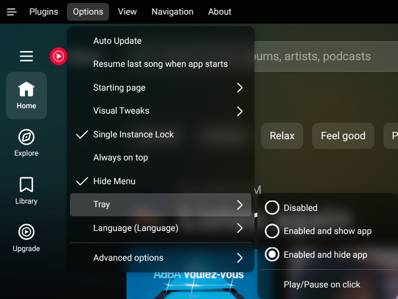
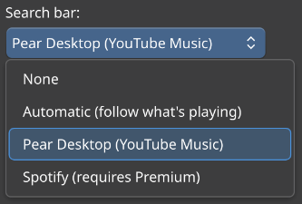
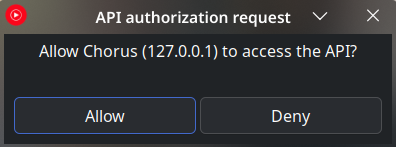
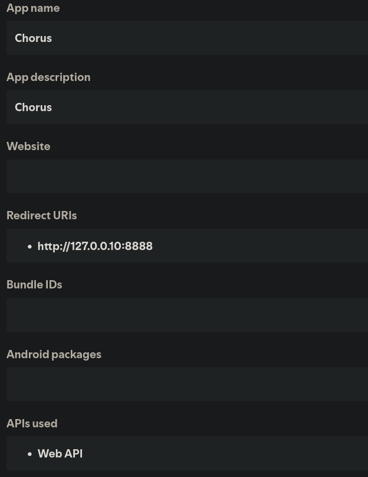
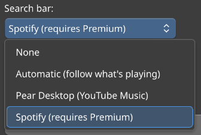
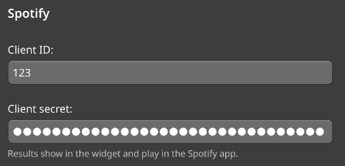
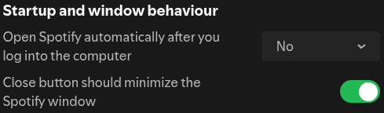

## Pear Desktop (YouTube Music)

   - Download and install [Pear Desktop](https://github.com/pear-devs/pear-desktop/releases), an open-source YouTube Music desktop client.

   - In the `Plugin` menu, enable the **API Server** plugin.

      

   - In the `Options` menu, set **Tray** to **Enabled and hide app**.

      

   - In the Chorus widget settings > `Music App`, set **Search Bar** to **Pear Desktop (YouTube Music)**.

      

   - Authorize Chorus on first use; this won't be needed again.
   
      

## Spotify

> [!NOTE]
> Spotify search requires a Spotify Premium account.

> Not tested yet.

   - Download and install [Spotify](https://www.spotify.com/download/) if you don't already have it.

   - Go to the [Spotify developer dashboard](https://developer.spotify.com/dashboard) and log in.

   - Create an app with these settings.

      

   - Copy the **Client ID** and **Client secret**.

   - In the Chorus widget settings > `Music App`, set **Search Bar** to **Spotify**.

      

   - Paste the **Client ID** and **Client secret** in Chorus.

      

   - In Spotify settings, near the bottom, enable **Close button should minimize Spotify window**.

      
